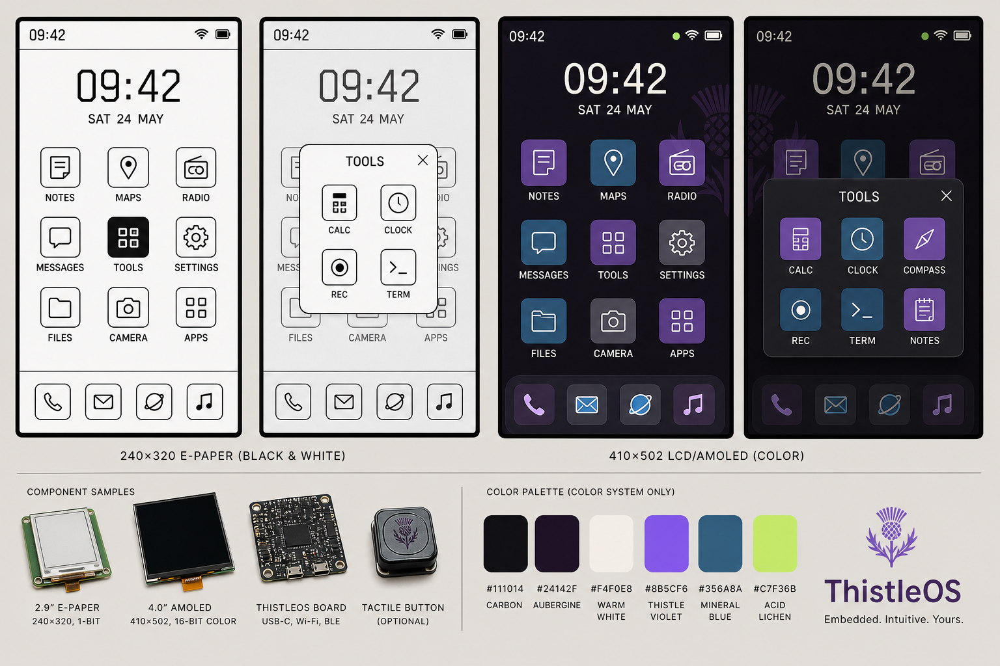
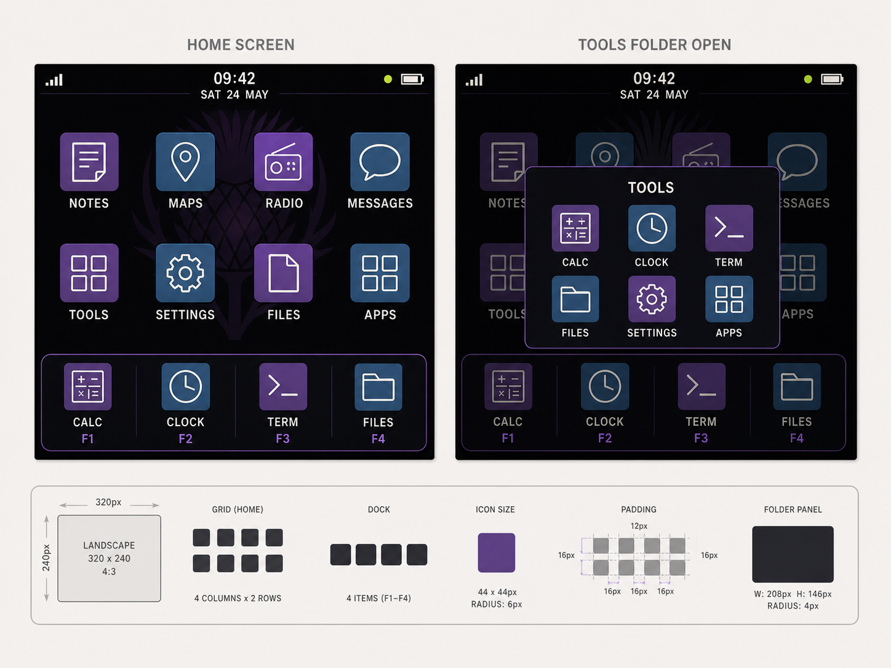

# ThistleOS visual language

Status: proposed direction, not yet the implemented widget specification
Last updated: 2026-08-07

Implementation backlog: [Phone-style launcher implementation TODO](IMPLEMENTATION-TODO.md)

ThistleOS uses a familiar phone-style launcher. The e-paper and colour window
managers may render it differently, but they share the same simple mental model:

1. status bar;
2. clock and date;
3. regular app and folder grid;
4. persistent favourites dock;
5. folder panel opened over the home screen;
6. an `Apps` icon for the complete app list.

The launcher should feel immediately understandable. Its distinctiveness comes
from the ThistleOS palette, icon family, type, and small graphic details—not an
unfamiliar shell.

## Selected concept

These generated boards are directional. Generated logos, device renders, text,
and icons are not shipping assets. Final assets must be deterministic,
repo-owned, licence-compatible, and verified at native resolution.

Earlier [Field Journal](field-journal-concept.png) and
[Night Instrument](night-instrument-concept.png) explorations are retained as
design history. Their dashboard and field-instrument shell is rejected. Useful
details—high-contrast e-paper focus, restrained colour, clipped corners, and
clear keyboard state—may be reused inside the conventional phone model.

## Shared launcher behaviour

### Home

- The home screen is intentionally simple: no default news, weather, activity,
  radio, navigation, or note widgets.
- A compact status bar contains time or connectivity state, signal, and battery.
- A larger clock/date region gives the otherwise quiet screen a useful anchor.
- Apps occupy a regular grid. Position is stable and user-arrangeable.
- Folders occupy one grid cell and preview their contents with four miniature
  glyphs. The label is the folder name.
- The bottom dock contains four user-selected favourites and remains present on
  every home page.
- `Apps` opens the complete app list. It is a normal grid item, not a permanent
  dashboard control.
- A subtle Thistle mark may sit behind the colour grid. It must remain faint and
  must not reduce label or focus contrast. E-paper defaults to plain white.

### Folders

- Selecting a folder opens one centred panel over the existing home screen.
- The panel has a title, close affordance, and a small regular icon grid.
- Selecting outside the panel or pressing Back/Escape closes it.
- Opening an app closes the folder before switching apps.
- E-paper uses an opaque white panel with a strong black outline. Background
  content may be reduced to outline or sparse stipple, but must not be redrawn
  continuously.
- Colour uses an opaque carbon/aubergine panel. The home behind it is dimmed by
  a flat overlay; no blur or glass effect.
- Folder pagination is allowed only when contents exceed the panel. Prefer a
  visible page indicator to a long scrolling mini-grid.

### All apps

- The all-apps view is a plain icon grid with optional alphabetical sections.
- Search is optional on keyboard-capable or sufficiently large devices.
- Installation and deletion do not silently rearrange the user's home pages.
- Newly installed apps appear in all apps and may be explicitly added to home.

### Navigation

- Touch selects and opens icons conventionally.
- Arrow keys move focus spatially through grid cells. Enter opens; Escape/Back
  closes a folder or returns home.
- Hardware function keys may map to dock items. Their key hints are subtle and
  only shown on devices where the mapping exists.
- Focus is always visible. Touch press feedback is not a substitute for keyboard
  focus.

## Responsive layouts

The model stays the same; only the grid reflows.

| Target | Home grid | Dock | Clock treatment | Folder grid |
| --- | --- | --- | --- | --- |
| 240 x 320 portrait e-paper | 3 columns x 3 rows | 4 items | centred, large | 2 x 2 or 2 x 3 |
| 320 x 240 landscape LCD | 4 columns x 2 rows | 4 items | compact, centred | 3 x 2 |
| 410 x 502 portrait AMOLED | 3 columns x 3 rows | 4 items | centred, large | 3 x 2 |

For smaller 128-pixel displays, do not shrink this grid until it is illegible.
Those devices need a compact launcher variant, likely a focused list or 2-column
grid, while retaining Home, Folder, Dock/Favourites, and All Apps semantics.

## E-paper WM treatment

The e-paper WM is a phone launcher designed natively for 1-bit output, not the
colour launcher after threshold conversion.

- Use only solid black, solid white, lines, and limited stipple or hatch.
- App glyphs are bold black line icons in a consistent optical box.
- Icon containers are outline-only at rest. The focused icon or folder inverts
  to black with white glyph and label.
- The wallpaper is blank by default. A user-selected 1-bit wallpaper is allowed
  if icon and text contrast remain deterministic.
- Avoid shadows, simulated grayscale, soft antialiasing, and decorative texture.
- Page and folder transitions are cuts. No decorative animation.
- Dirty only the old and new focus cells when moving focus where practical.
- Update the displayed clock only when the minute changes, preserving the
  current refresh-aware behaviour.
- A boot render is not proof of interaction correctness. Focus movement, folder
  open/close, page changes, app return, and minute transitions require explicit
  hardware refresh verification.

Suggested 240 x 320 starting geometry:

- 18–20 px status bar;
- 56–64 px clock/date region;
- 3 x 3 grid using roughly 56–62 px row pitch;
- 40–44 px icon optical box;
- 48–54 px dock;
- 10–11 px icon labels, 13–14 px body, 32–42 px clock.

## Colour WM treatment

The colour WM uses the same launcher behaviour with a warmer, more tactile
finish and faster feedback.

| Token | Hex | Use |
| --- | --- | --- |
| Carbon | `#111014` | background |
| Deep aubergine | `#24142F` | wallpaper mark and deep surface |
| Warm white | `#F4F0E8` | primary text and glyphs |
| Thistle violet | `#8B5CF6` | primary focus and selected icon |
| Mineral blue | `#356A8A` | secondary icon family and navigation context |
| Acid lichen | `#C7F36B` | tiny connected/live/healthy state only |
| Muted coral | `#E06C75` | error or destructive action |

- Use flat icon tiles with one-colour line glyphs. The initial family alternates
  violet, mineral blue, and neutral graphite; per-app rainbow branding is not
  required for built-in apps.
- Use 4–6 px corner radii on icons and folders. Avoid pills and oversized cards.
- A focused tile receives a 2 px violet outline plus strong text contrast.
- The dock is one quiet contained strip. On a landscape keyboard device it may
  show `F1`–`F4` hints below the labels.
- Folder and all-app transitions may animate briefly, but the final states must
  remain understandable with animations disabled.
- Avoid gradients, glass, blur, bloom, glossy surfaces, and dense live widgets.
- Test all palette tokens after RGB565 quantisation. Thin text uses warm white
  when violet or blue becomes marginal.

Suggested 320 x 240 starting geometry:

- 18–20 px status bar;
- 34–42 px clock/date region;
- 4 x 2 grid with a 40–44 px icon optical box;
- 54–62 px dock including optional function-key hint;
- 208 x 146 px maximum folder panel, adjusted after native font measurement.

## Shared identity primitives

- System chrome uses `THISTLE`; product and documentation contexts may use
  `ThistleOS` or the existing `thistle-os` mark.
- The existing triangular thistle is the canonical logo. Any simplified
  wallpaper mark must be derived deterministically and must not replace it.
- System icons use geometric monoline construction, square terminals, and a
  consistent optical box. Emoji are never system icons.
- Spacing uses a 4 px base rhythm: 4, 8, 12, 16, and 24 px.
- Time and counts use tabular figures.
- Labels and icon ordering remain consistent across WMs where the same apps are
  available.
- Semantic meaning remains stable: violet or inversion means focus/selection;
  lichen means live/healthy; coral means failed/destructive.

## Architecture boundary

The current boot path already selects `thistle-tk` for e-paper and the LVGL LCD
WM for colour displays. That remains the appropriate ownership boundary:

- `thistle-tk` owns the 1-bit icon renderer, home-grid focus, folder rendering,
  e-paper transitions, and dirty-region behaviour.
- The LVGL LCD WM owns the RGB icon renderer, wallpaper, folder animation, and
  responsive colour layouts.
- The launcher owns home-page contents and folder membership as user data.
- Apps request semantic widgets and states. They do not hard-code display type,
  hatch patterns, violet focus edges, or folder chrome.
- Shared launcher data must not force identical widget trees if that creates
  poor refresh behaviour on e-paper.

## Alternatives considered

### Field-instrument dashboard

Rejected as the shell. It gave ThistleOS a strong graphic personality but made
the home screen busier and less immediately familiar than desired. Elements can
survive inside specialist apps such as radio, maps, and diagnostics.

### One identical renderer on all displays

Rejected. Shared behaviour is valuable; identical pixels are not. E-paper focus
and refresh constraints deserve a native renderer, while colour can use richer
icon tiles, wallpaper, and transitions.

### Widget-first phone home

Deferred. Widgets create density and refresh pressure before the basic launcher
is stable. If added later, they should be optional, user-placed, and absent from
the default home.

### Fully skeuomorphic smartphone clone

Rejected. Familiar navigation does not require copying iOS or Android visual
assets. ThistleOS keeps its own icons, palette, geometry, and embedded-device
constraints.

## Implementation phases

### Phase 1: launcher data and primitives

- Define home pages, stable positions, folders, folder membership, and dock
  favourites in a versioned launcher model.
- Add semantic icon, folder, dock, focused, and wallpaper primitives to each WM.
- Finalise a deterministic icon grid and initial built-in icon set.
- Select font files, confirm licences and flash cost, and measure native sizes.

### Phase 2: e-paper home

- Replace the current text-abbreviation dock with real 1-bit glyphs.
- Implement the 3-column portrait grid, folders, four-item dock, and all apps.
- Preserve minute-only clock dirtying and add cell-level focus dirty regions.
- Add framebuffer fixtures for home, focused icon, open folder, and all apps.

### Phase 3: colour home

- Implement 4 x 2 landscape and 3 x 3 portrait layouts in the LVGL LCD WM.
- Add flat icon tiles, faint wallpaper mark, folder overlay, dock, and optional
  hardware key hints.
- Verify palette and type on RGB565 LCD and AMOLED targets.

### Phase 4: interaction and hardware verification

- Verify touch, keyboard spatial navigation, folder close behaviour, app launch,
  app return, home-page persistence, and app installation behaviour.
- On T-Deck Pro, verify focus movement, folder open/close, page change, and
  minute-transition refreshes on hardware—not only a successful boot render.

## Acceptance criteria

- A new user recognises the screen as a phone-like home launcher without help.
- Default home contains only status, clock/date, icons/folders, and dock.
- Folders open over home and close through touch and keyboard conventions.
- Every interactive icon has visible keyboard focus and adequate touch size.
- E-paper remains legible with exactly two pixel values and no simulated gray.
- Colour survives RGB565 conversion without losing icon, label, or focus
  contrast.
- Home arrangement, folders, and dock persist across reboot and app updates.
- App code remains independent of the selected WM and display technology.

## Open questions

- Should new installations start with one curated home page or place every
  built-in app on home until the user organises it?
- Is the all-apps view paged, vertically scrolling, or selectable per WM?
- Should folders be limited to one page on e-paper to avoid awkward nested
  pagination?
- Which four apps belong in the default dock on keyboard and touch devices?
- Does the launcher need drag-and-drop initially, or can an explicit `Arrange`
  mode provide more reliable touch and keyboard behaviour?
- How should a user recover a removed `Apps` icon? It may need to be fixed or
  protected from deletion even if its position is movable.
